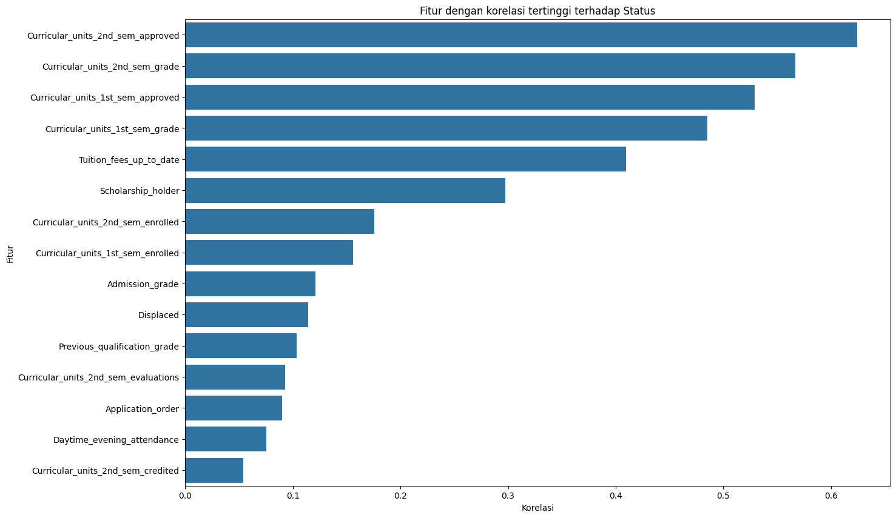

# Proyek Akhir: Menyelesaikan Permasalahan Perusahaan Edutech

## Business Understanding
Jaya Jaya Institut merupakan salah satu institusi pendidikan perguruan yang telah berdiri sejak tahun 2000. Hingga saat ini ia telah mencetak banyak lulusan dengan reputasi yang sangat baik. Akan tetapi, terdapat banyak juga siswa yang tidak menyelesaikan pendidikannya alias dropout.

### Permasalahan Bisnis
Jumlah dropout yang tinggi ini tentunya menjadi salah satu masalah yang besar untuk sebuah institusi pendidikan. Oleh karena itu, Jaya Jaya Institut ingin mendeteksi secepat mungkin siswa yang mungkin akan melakukan dropout sehingga dapat diberi bimbingan khusus.

dalam proyek ini ada beberapa permasalahan bisnis yang akan diselesaikan yaitu:
1. menganalisis faktor-faktor apa saja yang paling mempengaruhi mahasiswa mengalami Dropout
2. membangun sebuah sistem Machine Learning untuk dapat memprediksi apakah mahasiswa akan dropout atau tidak.
3. membangun sebuah dashboard guna memonitoring performa dari mahasiswa.

### Cakupan Proyek
Cakupan proyek yang dikerjakan adalah sebagai berikut:
1. Melakukan Data Preparation/Cleansing, untuk membersihkan serta mempersiapkan data untuk dapat digunakan lebih lanjut seperti visualisasi, membuat model ML dan membuat dashboard.
2. Melakukan Exploratory Analysis (EDA) guna mengidentifikasi pola, tren serta fitur yang paling berpengaruh dalam Status mahasiswa.
3. Membuat Model Machine Learning menggunakan Algoritma Random Forest guna mengklasifikasikan status mahasiswa berdasarkan fitur yang paling berpengaruh.
4. Melakukan deployment terhadap model yang telah dilatih sebelumnya untuk mempermudah penggunaan prototype. model di deploy menggunakan Streamlit.
5. Membuat Dashboard menggunakan public tableau guna mempermudah dalam monitoring performa dari mahasiswa.
6. Memberikan Rekomendasi Action Items kepada Jaya-Jaya Institut untuk membantu mereka dalam menurunkan angka mahasiswa yang terkena DO.

### Persiapan

Sumber data: [Sumber Data](https://raw.githubusercontent.com/dicodingacademy/dicoding_dataset/refs/heads/main/students_performance/data.csv)

Setup environment:
- Clone Repositories
```
git clone https://github.com/josh209062/proyek-akhir.git
cd proyek-akhir
```
- Membuat Virtual Environment
```
python -m venv .venv
```
- Mengaktifkan Virtual Environment
```
.\.venv\Scripts\activate
```
-Menginstall Requirements Virtual Environtment
```
pip install -r requirements.txt
```

## Business Dashboard
Dashboard yang dibangun pada proyek ini menggunakan Public Tableau. Pada dashboard ini menampilkan total keseluruhan mahasiswa, total mahasiswa Graduate, Enrolled, dan Dropout, serta Dropout rate mahasiswa dari Jaya Jaya Institut. selain itu visualisasi yang dibuat pada dashboard ini berdasarkan 15 fitur yang paling berpengaruh pada status mahasiswa, yang didapatkan pada proses Exploratory Data Analysis (EDA). Visualisasi yang dibuat menggunakan Bar Chart serta Area Chart, dimana Area Chart pada fitur Curricular Units baik semester 1 dan 2, selebihnya menggunakan Bar chart. Pada Dashboard juga dapat dilihat bagaimana persebaran status (Dropout, Enrolled, dan Graduate) berdasarkan ke lima belas fitur tersebut.

Berikut link dashboard: [Jaya Jaya Institute Student Performance Dashboard](https://public.tableau.com/views/StudentsPerformanceDashboard_17505973396140/Dashboard1?:language=en-US&publish=yes&:sid=&:redirect=auth&:display_count=n&:origin=viz_share_link)


## Menjalankan Sistem Machine Learning
Ada dua cara untuk menjalankan sistem Machine Learning yang telah dibangun 
1. Menjalankan sistem secara lokal
setelah melakukan persiapan setup environment, selanjutnya dapat menjalankan kode berikut pada terminal/powershell.
```
streamlit run app.py
```
secara otomatis akan dialihkan ke website, jika tidak dapat mengetik link url(seusaikan dengan link yang ada di terminal/powershell) berikut

```
http://localhost:8501/
```
2. Menjalankan sistem secara online
untuk menjalankan sistem secara online dapat mengakses link berikut: [Jaya Jaya Institut]()

## Conclusion
Jaya-Jaya Institut memiliki total 4424 mahasiswa dengan rincian sebagai berikut 2209 mahasiswa Graduate, 794 Mahasiswa Enrolled, dan 1421 Mahasiswa Dropout. Dengan Dropout Rate mahasiswanya mencapai 32.12%, yang mana hal ini tergolong tinggi. Berdasarkan hasil analisis ada beberapa fitur yang sangat mempengaruhi mahasiswa terkena Dropout seperti pada chart berikut:


berdasarkan chart tersebut, dapat dilihat bahwasanya:
- curricular units baik semester 1 dan 2 sangat mempengaruhi status mahasiswa, terutama mahasiswa terkena Dropout. dikarenakan jika pada awal semester mahasiswa memiliki performa yang tidak baik akan sangat mempengaruhi di semester berikutnya.
- mahasiswa yang terkendala dalam biaya perkuliahaan cenderung untuk dropout.
- selain itu nilai sebelum dan sesudah masuk juga mempengaruhi bagaimana kelanjutan status mahasiswa kedepannya begitu pula dengan application order ketika masuk yang di dominasi pada pilihan pertama.
- mahasiswa yang tidak memegang beasiswa lebih cenderung untuk DO jika dibandingkan dengan mahasiswa yang Graduate.


### Rekomendasi Action Items


- dapat menerapkan solusi sistem machine learning yang telah dibangun guna memantau dan memprediksi status mahasiswa kedepannya.
- melakukan evaluasi setiap semester untuk melihat perkembangan performa dari mahasiswa, sehingga mahasiswa yang mememiliki performa buruk dapat diberikan bimbingan secara akademis.
- membantu mahasiswa yang memiliki kendala biaya seperti dengan memberikan keringanan biaya, penambahan jangka tempo pembayaran guna mencegah terjadinya Dropout. selain itu juga dapat memberikan informasi lebih mengenai beasiswa dan pembimbingan untuk mendapatkan beasiswa tersebut.